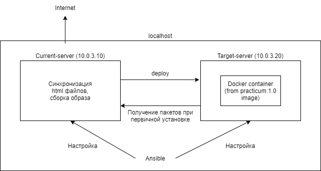

# Репозиторий для практикума по автоматизации курса Skillfactory: DevOps

# Задание
https://github.com/SkillfactoryCodingTeam/devops__project__automation

# Решение
С помощью Ansible подгатавливается инфраструктура, имитирующая сервера и настраиваются имитируемые сервера:
- создается два lxd контейнера: currnet-server и target-server
- currnet-server имитирует работу сервера, на котором синхронизируют файлы, собирается образ и докер и настраивается крон задание
- target-server имитирует работу сервера, на котором запускается образ докер. 
target-server по условию не подключен к интернету, поэтому на currnet-server также настраивается apt-cacher, а target-server использует его в качестве apt зеркала
Для загрузки образа и запуска контейнера докер используется докер клиент с взаимной аутентификацией по сертификату 

# Установка
Установка контейнеров, имитирующих сервера выполняется на локальный компьютер с помощью Ansible:
- установить Ansible командой sudo apt install ansible
- скопировать содержимое репозитория в каталог
- перейти в каталог, после чего перейти в каталог scripts
- выполнить команду ./gen-crt.sh для генерации сертификатов докер (нужно ввести пароль к генерируемому корневому сертификату)
- перейти в каталог выше и выполнить ./run.sh
- ввести пароль sudo 

# Проверка
Задания можно выполнить вручную:

*make -f /opt/practicum/Makefile sync* получения .html файлов 

*make -f /opt/sync-mirror/Makefile deploy* для пересборки и запуска контейнера

Для удобства при сборке используется прямой вызов bash, весь вывод должен быть отформатирован правильно

Получить доступ к статьям можно перейдя в браузере по адресу:

*http://10.0.3.20/bugs.html*

# Дополнительные задания

Можно сделать синхронизацию отдельного языка, например:

*make -f /opt/sync-mirror/Makefile sync_en*

Список языков можно посмотреть в Makefile

Для того чтобы не использовать докер можно использовать lxc/lxd контейнер или настроить выделенный путь на веб-сервере для доступа к .html файлам

# Важные моменты
При остановке и удалении контейнеров используется конструкция типа [команда];:; 
Это необходимо, чтобы make продолжал работу, если в этих командах будет ошибка.
Например, если команды запускаются первый раз, то контейнера не будет, останавливать нечего и нужно переходить к следующим шагам
